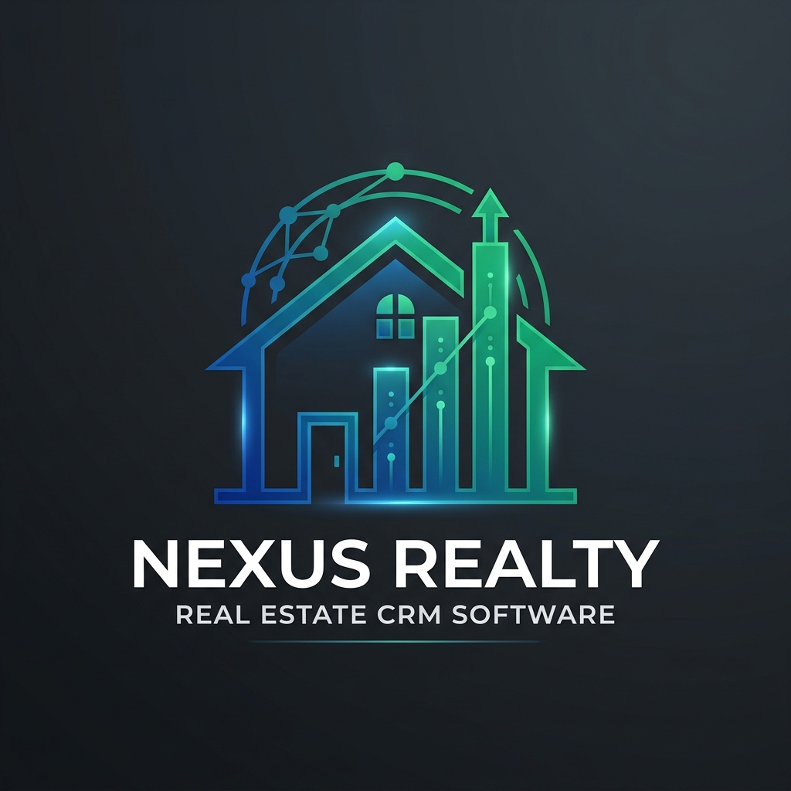

# 🏰 Real Estate CRM & Lead Management System



[](https://nodejs.org/)
[](https://reactjs.org/)
[](https://www.prisma.io/)
[](https://www.postgresql.org/)
[](https://socket.io/)

A comprehensive, full-stack CRM solution tailored for real estate agencies. Streamline your lead management, property listings, and team collaboration with a modern, high-performance platform.

---

## 🚀 Key Features

### 🏢 Property & Asset Management
- **Centralized Database**: Manage residential, commercial, land, and industrial properties.
- **Rich Media**: Multi-image support and detailed specifications for every listing.
- **External Integration**: Capabilities to track external property sources and snippets.

### 🎯 Lead & Client Lifecycle
- **Lead Scoring**: Intelligent scoring system based on interaction and potential.
- **Activity Tracking**: Comprehensive history of calls, emails, visits, and meetings.
- **Deal Pipeline**: Visualized deal stages from initial inquiry to final closure.

### 💬 Real-time Team Collaboration
- **Dynamic Channels**: Create team-specific or topic-specific chat channels.
- **Rich Interaction**: Support for @mentions, emoji reactions, and message threads/replies.
- **Presence Indicators**: Real-time online/offline status and typing indicators.

### 🤖 Automated Workflows
- **Auto-Responders**: Instant email responses for new lead inquiries.
- **Daily Summaries**: Automated task and activity summaries sent to agents via email.
- **Follow-up Reminders**: Scheduled notifications for client engagements.

---

## 🛠️ Tech Stack

### Frontend
- **Framework**: React 19 (Vite)
- **Icons**: Lucide React
- **Charts**: Recharts (Analytics & Insights)
- **State Management**: React Context API
- **Communication**: Socket.io-client

### Backend
- **Runtime**: Node.js
- **Framework**: Express.js
- **Database ORM**: Prisma
- **Real-time**: Socket.io
- **Mailing**: Nodemailer
- **Scheduling**: Node-cron

---

## 📂 Project Structure

```text
Lead_management/
├── backend/            # Express server & Prisma configuration
│   ├── prisma/         # Schema, migrations, and seed data
│   ├── src/
│   │   ├── routes/     # API endpoints
│   │   ├── services/   # Business logic & background jobs
│   │   └── socket.js   # Real-time event handling
├── frontend/           # React client application
│   ├── src/
│   │   ├── components/ # Reusable UI components
│   │   ├── pages/      # Feature-specific views
│   │   └── services/   # API & Socket integration
└── assets/             # Project branding & documentation media
```

---

## ⚙️ Getting Started

### Prerequisites
- Node.js (v18+)
- PostgreSQL instance

### Installation

1. **Clone the repository**
   ```bash
   git clone https://github.com/your-username/realestate-crm.git
   cd realestate-crm
   ```

2. **Setup Backend**
   ```bash
   cd backend
   npm install
   # Create .env file with DATABASE_URL, JWT_SECRET, SMTP_HOST, etc.
   npx prisma migrate dev
   npx prisma db seed
   npm run dev
   ```

3. **Setup Frontend**
   ```bash
   cd ../frontend
   npm install
   # Create .env file with VITE_API_URL
   npm run dev
   ```

---

## 🔒 Security & Access
The system implements a robust **Role-Based Access Control (RBAC)**:
- **ADMIN**: Full system access, user management, and global analytics.
- **MANAGER**: Team management, channel creation, and performance tracking.
- **AGENT**: Lead management, client interactions, and personal deal tracking.

---

## 📄 License
This project is licensed under the ISC License.

---

Developed with ❤️ for the Real Estate Industry.
